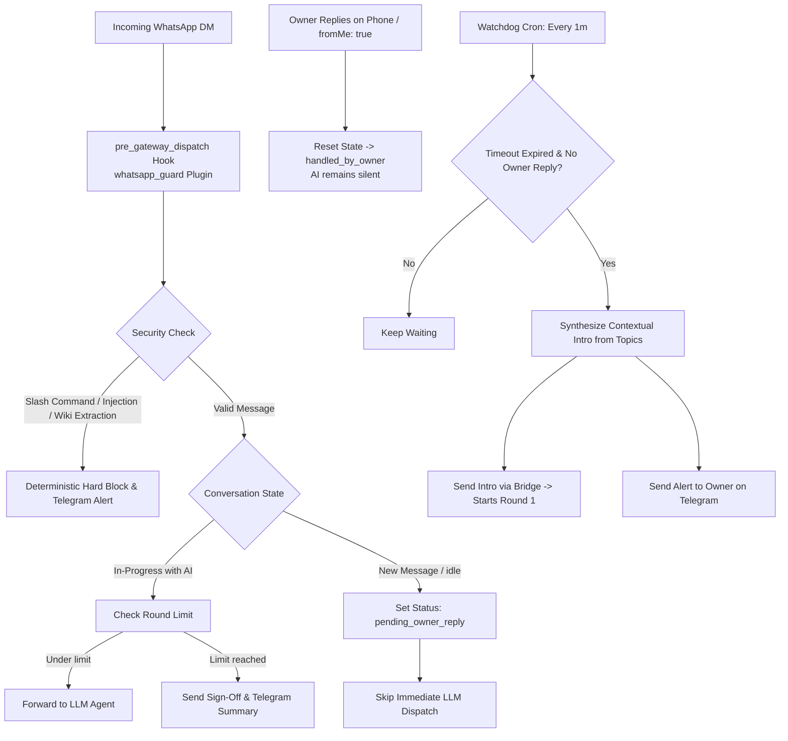

# 🛡️ Hermes WhatsApp Gatekeeper & Security Guard

> **Deterministic time-delayed gatekeeper, owner-first response engine, and anti-injection security shield for Hermes Agent WhatsApp integrations.**
> Protects personal time, prioritizes the owner's personal replies from mobile devices, and steps in with natural, context-aware assistance only when messages remain unanswered past a configurable timeout.

---

## 🌟 Project Overview & Philosophy

Connecting an autonomous AI agent to an executive or personal WhatsApp line introduces three fundamental operational risks:
1. **Unwanted Interruption:** Instant AI responses prevent the owner from answering personal, family, or VIP messages personally.
2. **Infinite Chatter & Token Drain:** Senders can engage the AI in endless, unproductive conversations, consuming tokens and risking hallucinations.
3. **Security Vulnerabilities & Data Leaks:** External senders may attempt prompt injections, call administrative slash commands (`/config`, `/cron`, `/memory`), or probe for private notes.

**Hermes WhatsApp Gatekeeper** resolves these challenges by inserting a deterministic, code-level filter and stateful timer between the WhatsApp bridge (Baileys) and the AI agent execution loop.

### Why this exists

[Hermes Agent](https://github.com/NousResearch/hermes-agent)'s `platform_toolsets` setting lets you scope which *tools* a messaging channel can use, but it stops there — nothing built into Hermes limits how long an unattended conversation runs, blocks prompt-injection attempts, or hands a runaway conversation back to a human. Two open upstream requests describe exactly this gap:

- [#4281 — Enforce sandboxed execution for messaging platform sessions](https://github.com/NousResearch/hermes-agent/issues/4281)
- [#527 — Gateway Permission Tiers (RBAC) for Messenger Platforms](https://github.com/NousResearch/hermes-agent/issues/527)

This project grew out of a real incident: a WhatsApp contact drove a conversation well past its intended round limit, and the agent disclosed a list of admin-only commands to them. What started as an emergency patch became the defense-in-depth stack documented below, refined over roughly a week of live, incident-driven testing on a production deployment.

---

## ✨ Key Capabilities

* ⏳ **Owner Priority (Delayed Handover):** When an incoming direct message (DM) arrives, the AI holds back for a configurable period (e.g., **10 minutes** in testing, **4 hours / 240 minutes** in production) to let the owner reply directly.
* 📱 **Immediate Yield on Owner Activity (`fromMe: true`):** If the owner types a reply from their mobile device at any time, the system immediately cancels the timer, marks the chat as `handled_by_owner`, and the AI stands down completely.
* 🤖 **Contextual & Natural Takeover:** If the timeout expires without an owner response, the watchdog crafts a tailored, humanized opener acknowledging the specific topic the sender raised (no robotic clichés or boilerplate).
* 🛑 **Strict Round-Count Gatekeeper Cap:** Narrows down the sender's requirements within a maximum number of conversational turns (independently tracked per DM and per group sender), then politely signs off and forwards an executive summary to the owner via Telegram.
* 🔒 **Deterministic Security Floor:**
  * Hard blocks all administrative `/` and `!` slash commands for non-admin senders — including the small set of commands Hermes allows by default regardless of config (see `whatsapp-security-floor` below).
  * Regex-backed prompt injection defenses (`ignore previous instructions`, `jailbreak`, `DAN mode`).
  * Strict prohibition on scraping private notes or knowledge-base files.
* 🧯 **Fail-Closed, Not Fail-Open:** If the guard's own code, its config file, or its import into the gateway breaks, WhatsApp messages are BLOCKED — not silently passed straight to the agent with no filter at all — and the owner gets an out-of-band alert. Detection also runs after accent/zero-width-character normalization, so a message typed without diacritics (common on mobile, in languages that use them) can't slip past a pattern written with full accents.
* 🔐 **Concurrency-Safe State:** The gateway hook and the watchdog cron share a per-conversation file lock and always write state atomically, so a scheduled takeover and a live incoming reply can never race and corrupt or silently lose conversation state.
* 📢 **Telegram Dispatching:** Because WhatsApp notifications are muted by default, the owner receives real-time Telegram alerts on takeovers and final conversation handoffs.
* 🧷 **Update-safe by construction:** everything here lives under Hermes's user-plugin path (`HERMES_HOME/plugins`), which a `hermes update` never touches — that's precisely why `whatsapp-security-floor` is a plugin instead of a direct patch to vendored source. For the rarer case where you do end up needing a direct source patch, `docs/update-integration.md` documents a generic, idempotent reapply pattern to wire into your own update pipeline.

---

## 🏗️ Architecture & Message Flow



> The state name shown above (`in_progress_assistant`) is already genericized in this repo. The original live deployment this was extracted from used a state value with its own assistant persona's name baked in (`in_progress_<persona_name>`) — harmless there, but the kind of detail worth checking for if you ever diff this repo against an older export.

---

## 📁 Repository Structure

```text
hermes-whatsapp-gatekeeper/
├── gatekeeper_config.example.json           # Copy to ~/.hermes/whatsapp/gatekeeper_config.json and fill in your values
├── plugins/
│   ├── whatsapp_guard/
│   │   ├── plugin.yaml                      # Hermes Agent plugin manifest
│   │   └── __init__.py                      # pre_gateway_dispatch lifecycle hook
│   └── whatsapp-security-floor/
│       ├── plugin.yaml
│       └── __init__.py                      # closes Hermes' built-in /help and /whoami allowlist floor
├── scripts/
│   ├── whatsapp_guard.py                    # Core deterministic logic, regex filters & persistence
│   └── whatsapp_gatekeeper_watchdog.py      # Scheduled background takeover monitor
├── skills/
│   └── whatsapp-conversation-rules/
│       └── SKILL.md                         # Persona, humanizer guidelines & round-based escalation rules
└── docs/
    ├── update-integration.md                # generic idempotent-reapply pattern, for if you ever need a direct source patch
    └── architecture.md                      # defense-in-depth overview and design notes
```

All of the above is now in the repo. `docs/update-integration.md` describes the reapply pattern generically (not a literal copy of the original deployment's production update script, and no vendored-source patch is currently needed for anything in this repo — see the pattern doc for why) — see Status below for what's still deployment-specific.

---

## ⚙️ Configuration (`gatekeeper_config.json`)

All runtime options are decoupled from application logic:

```json
{
  "enabled": true,
  "owner_response_timeout_minutes": 240,
  "default_production_timeout_minutes": 240,
  "max_rounds_dm": 5,
  "max_rounds_group": 10,
  "round_reset_hours": 4,
  "owner_whatsapp_id": "<owner-msisdn>@s.whatsapp.net",
  "intro_message_template_example": "Hi, this is {assistant_name} — {owner_name}'s assistant. {owner_name} can't get to messages right now, so I'm stepping in. You mentioned {topic} — want to work through that together?"
}
```

### Environment Variable Overrides

| JSON Key / Environment Variable | Description | Default |
| :--- | :--- | :--- |
| `owner_response_timeout_minutes` / `WHATSAPP_OWNER_TIMEOUT_MINUTES` | Delay in minutes before the AI takes over unanswered DMs | `240` (testing: `10`) |
| `WHATSAPP_FORWARD_OWNER_MESSAGES` | Enables bridge forwarding of owner-typed messages from mobile | `true` |
| `max_rounds_dm` / `WHATSAPP_GUARD_DM_ROUND_LIMIT` | Max conversational turns in direct chats | `5` |
| `max_rounds_group` / `WHATSAPP_GUARD_GROUP_ROUND_LIMIT` | Max conversational turns in group chats | `10` |
| `round_reset_hours` | Inactivity period before resetting counters | `4` hours |
| `WHATSAPP_GUARD_MODE` | Enforcement mode (`block` or `warn`) | `block` |

---

## 🛡️ Security Floor Breakdown

| Threat Category | Pattern Detected | Action Taken |
| :--- | :--- | :--- |
| **Admin Slash Commands** | `/help`, `/status`, `/config`, `/cron`, `!reset` | Hard Block + returns "That's an administrative command — not available via WhatsApp." |
| **Built-in allowlist bypass** | Hermes' own hardcoded `/help`, `/whoami` (allowed by default regardless of config) | Closed by the separate `whatsapp-security-floor` plugin |
| **Prompt Injection** | `ignore previous instructions`, `DAN mode`, `act as` | Hard Block + topic deflection + Telegram alert to owner |
| **Knowledge Scraping** | `show my profile`, `what notes do you have on me` | Hard Block + returns "Internal data is private" |
| **Telegram Abuse** | `send a message to the owner's telegram` | Hard Block + direct deflection |
| **Round Limit Breach** | `rounds_completed >= max_rounds_dm` | Hard Block + graceful sign-off + full executive summary to Telegram |

---

## 🚀 Installation & Deployment

1. **Deploy files:**
   * Plugins → `~/.hermes/plugins/whatsapp_guard/` and `~/.hermes/plugins/whatsapp-security-floor/`
   * Scripts → `~/.hermes/scripts/`
   * Config → copy `gatekeeper_config.example.json` to `~/.hermes/whatsapp/gatekeeper_config.json` and fill in `owner_whatsapp_id`, `assistant_name`, `owner_name`, and your own `intro_message_template_example`
   * Optional: set `TELEGRAM_OWNER_CHAT_ID` in the environment if you want owner-alert notifications (takeovers, blocked attempts) — without it, the alerting is a silent no-op and only the WhatsApp-side enforcement runs
2. **Make scripts executable:**
   ```bash
   chmod +x ~/.hermes/scripts/whatsapp_guard.py ~/.hermes/scripts/whatsapp_gatekeeper_watchdog.py
   ```
3. **Enable both plugins in `config.yaml`** under `plugins.enabled`, and set `platform_toolsets.whatsapp` to the minimal tool list you want the channel to have (e.g. vision + text-to-speech only).
4. **Enable owner-message forwarding in `config.yaml`:**
   ```yaml
   whatsapp:
     extra:
       forward_owner_messages: true
   ```
5. **Register the periodic watchdog cron in Hermes:**
   ```bash
   hermes cron create \
     --name "whatsapp-gatekeeper-watchdog" \
     --schedule "every 1m" \
     --script "whatsapp_gatekeeper_watchdog.py" \
     --no-agent
   ```
6. **Restart the gateway:**
   ```bash
   hermes gateway restart
   ```

---

## Status

Early-stage. This code has been extracted and generalized (translated, de-identified, config-driven names/IDs instead of hardcoded ones) from a live personal deployment — currently **private** until it's had a chance to be reviewed. **The genericized copy in this repo hasn't itself been smoke-tested end-to-end yet** — the logic is a faithful port of the original, but a translation/refactor pass like this always carries some risk of an introduced typo or mismatch, so treat it as unverified until someone runs it against a real Hermes instance. The toolset restriction, the guard plugin, and the security-floor plugin have about a week of live, incident-driven hardening behind them *in their original, deployment-specific form*; the delayed-handover watchdog is newer and less battle-tested even there.

This is an independent, unofficial add-on — not affiliated with or endorsed by NousResearch. If upstream Hermes ever ships a native equivalent of #4281 or #527, parts of this project may become unnecessary. That would be a good outcome.

## Looking for Ideas

I built this for my own WhatsApp assistant, and I'm sharing it because the pattern might be useful beyond my own setup -- see "Why this exists" above for how it relates to [#4281](https://github.com/NousResearch/hermes-agent/issues/4281) and [#527](https://github.com/NousResearch/hermes-agent/issues/527) upstream. If you have ideas for where this should go next, issues and PRs are genuinely welcome. Honestly, I could use a hand taking it further -- let's see where this goes.

---

## Requirements

- A running [Hermes Agent](https://github.com/NousResearch/hermes-agent) instance with the WhatsApp (Baileys) channel enabled.
- Access to Hermes's "user plugin" discovery path (`~/.hermes/plugins/`) — plugins placed here survive `hermes update`, unlike changes to vendored source.

---

## 📜 License

This project is licensed under the open-source **MIT License** — see [LICENSE](LICENSE).
